# TUGAS WRITING WEEK 1-Kind Knucker

## **1. CLI (Command Line Interface)**
* **Shell** merupakan program yang digunakan untuk  berkomunikasi atau memerintah sistem
* Shell yang berbasis teks dinamakan **Command Line Interface**
    - Contoh CLI :
    1. sh
    2. bash
    3. zsh
    4. cmd.exe

* Aplikasi yang digunakan untuk mengakses CLI disebut **Terminal Emulator**

## Mana sih yang dinamakan terminal ?

> *Nah, gambar di atas merupakan tampilan sebuah terminal emulator*

### Navigation
    1. pwd (Print working directory)
    Command untuk mengetahui kita sedang berada di direktori mana saat ini
    
    2. ls (list)
    Command untuk menampilkan daftar file dan folder yang ada di sebuah direktori
    
    3. ls -la
    Command untuk menampilkan daftar file yang di hidden
    
    4. Touch
    Command untuk membuat suatu file pada direktori
    
    5. Cp
    Command untuk copy file /direktori
    
    6. Mv
    Command untuk memindahkan file/dirketori. Bisa digunakan untuk rename.
    mv nama_file_yang_mau_dipindahkan.ekstensi directory_yang menjadi_tujuan

    7 rm
    Command untuk menghapus file
    rm nama_file_yang_mau_dihapus.ekstensi

    8. rm -r
    COmmand untuk menghapus suatu folder
    rm -r nama_folder_yang_dihapus.ekstensi
    
    9. Cd (Change directory)
    Command untuk berpindah direktori/folder
    
    10. Cd ..
    Command untuk back/ kembali ke direktori sebelumnya
    
    11. Clear
    Command untuk membersihkan tampilan terminal

    12.  mkdir
    Command untuk membuat folder /direktori

    Membuat folder tanpa spasi : mkdir nama_folder_baru
    Membuat Folder dengan spasi: mkdir "nama folder baru"


## **2. GIT & GITHUB**
* **GIT** merupakan tools untuk programmer yang dapat melacak setiap perubahan file/folder.
    * GIT biasanya digunakan sebagai tempat penyimpanan file pemrograman.
    * File yang disimpan menggunakan GIT akan terlacak seluruh perubahannya, termasuk siapa yang mengubah file tersebut.
    * Setelah kita menginstall GIT, yang pertama kita lakukan adalah :
    1. konfigurasi akun git di git bash
       * 
    
        Note : email yang disetup *harus* sama dengan yang digunakan pada Github

    2. **git config --list** untuk melihat/cek hasil konfigurasi
        * 
    
    * Vendor/penyedia GIT
    1. Github
    2. Gitlab
    3. Bitbucket

* ### **GITHUB** untuk mengonlinekan codingan

    Dengan menggunakan GIT dan Github, kita bisa bekerja dalam sebuah tim. Tujuannya adalah kita bisa berkolaborasi mengerjakan proyek yang sama
    
    

* Repository adalah direktori proyek yang kita buat
* Repository GIT
1. **git init**
 untuk menginisialisasi git di folder/directory kerja kita
catatan : lakukan di dalam folder proyek

    *Note : untuk menghubungan git ke akun github menggunakan cara di bawah ini*
    
    *Cek apakah sudah terconnect atau belum dengan **git remote -v***
    
    *Jika sudah muncul tampilan seperti gambar di atas artinya akun github kita sudah terconnect*


2. **git status** untuk mengecek status dari git kita dan melihat adanya perubahan atau tidak yang dilakukan pada proyek tersebut, biasanya itu tentang file yang belum di add atau di commit

3. **git add** untuk mendaftarkan perubahan file pada suatu proyek ke staging area dan masih perlu di commit

    *Note : **Kondisi File pada GIT***
    * **modified** = kondisi dimana perubahan sudah dilakukan tapi belum ditandai (untracked)
    * **staged** = kondisi dimana perubahan file sudah ditandai (modified), tapi belum di simpan di version control
    * **commited** = perubahan sudah disimpan pada version control

4. **git add .** untuk menambahkan seluruh file yang belum di add ke staging 

5. **git commit -m "Pesan Commit"** untuk menyimpan perubahan ke dalam version control

6. **git log** untuk melihat history / kumpulan checkpoint(commit) yang telah kita buat

7. **git revert (nomor commit)** untuk kembali ke checkpoint tanpa menghapus committan sesudahnya.
 
8. **git reset (nomor commit)** untuk kembali ke checkpoint dengan menghapus committan sesudahnya.

9. **git branch** untuk melihat kumpulan branch

10. **git branch (nama branch yang di inginkan)** untuk membuat branch baru

11. **git checkout (nama branch)** untuk pindah ke branch yang kita inginkan

12. **git checkout -b (nama branch)** untuk membuat branch baru dan langsung pindah ke branch yang kita baru buat

13. **git branch -d (nama branch)**
  menghapus branch 

14. **git merge (nama target branch yang ingin kita tarik)** untuk menggabungkan kedua buah branch

15. **git push -u origin main** untuk mengirim (upload) perubahan yang sudah kita buat di local ke remote repository kita

16. Untuk berkolaborasi dengan orang lain, kita harus punya salinan dari proyek kita, caranya yaitu :
**git clone** *Link Repository* *Nama Folder*

## **3. HTML**
        HTML (Hyper Text Markup Language) adalah bahasa markup yang berfungsi membuat kerangka untuk halaman website. 
        HTML digunakan untuk menampilkan konten pada browser. Konten yang ditampilkan contohnya yaitu Text, Image, Video, Link, dan lainnya. 
                
### => Tools yang digunakan HTML
Ada 2 tools utama yang harus dipersiapkan dalam membuat HTML :
1. Browser
2. Code Editor


### => Dasar-Dasar HTML
        Kita bisa menuliskan HTML tanpa structure dan kita bisa tetap menjalankan nya tetapi untuk menjalankannya dengan baik kita perlu HTML Structure

### => Struktur HTML
```StrukturHTML
<!DOCTYPE html>
<html lang="en">
<head>
    <meta charset="UTF-8">
    <meta name="viewport" content="width=device-width, initial-scale=1.0">
    <title>Arsy Gallery</title> 
</head>

<body>
   This is my first writting 
</body>
```

- **!DOCTYPE html** : menyatakan bahwa dokumen ini dokumen HTML
- **tag html** : merupakan parent element
- di dalam parent element terdapat child element yaitu *tag head* dan *body*

### HTML tersusun sebagai kesatuan dari sebuah tingkatan (family tree relationship). Saat sebuah element berada di dalam element lain, maka disebut **child element**. Element yang berada diatas element lain disebut **parent element**. Berikut ini merupakan contoh penulisan HTML

### **HTML Tag**
HTML terdiri dari komponen yang disebut **HTML Tag**
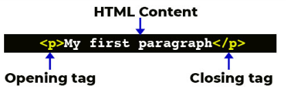

HTML Tag ada 2 tipe :
- Opening Tag (Tag Pembuka)
- Closing Tag (Tag Penutup)


### **HTML Element**
HTML element didefinisikan dengan opening tag, content, dan closing tag.

### **HTML Atribute**
Attribute adalah properties dari sebuah element HTML. Di dalam Opening Tag dapat berisi attribute, yang berfungsi untuk memberikan informasi tambahan kepada sebuah element.

Atribut / Properties HTML
- id
- class
- name

### **HTML Comment**
adalah sebuah cara untuk mematikan sebuah code/membuat komentar yang hanya bisa dibaca oleh programmer. Cara menuliskan html yaitu sebagai berikut
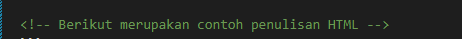
Dengan menggunakan HTML Comment kita bisa memberikan penjelasan maksud dari line code yang kita kerjakan.
Comment ini tidak akan di eksekusi oleh sistem.


```HTML
<!DOCTYPE html>
<html lang="en">
<head>
    <meta charset="UTF-8">
    <meta name="viewport" content="width=device-width, initial-scale=1.0">
    <title>Arsy Gallery</title> 
</head>

<body>
    <div>
        <h1>Hai this is Arsy Gallery</h1>
        <p>Since childhood, Arsy has often been covered by the media and has been a guest star on TV programs. He likes to sing since childhood which is a inherited talent of his parents. He often covers songs like Aisyah Istri Rasulullah which was trending on YouTube. In 2019, he released his first single entitled "Ayah Bundaku" which was dedicated to his parents.</p>
    </div>
    <div>
        <h1>Arsy's Profile</h1>
        <ul>
            <li>Name : Arsy Addara Musicia Nurhermansyah</li>
            <li>Age : 8 years old</li>
            <li>place and date of birth : Jakarta, 14 Desember 2014</li>
            <li>Education : Al Jabr Islamic School Pre Kindergarten</li>
            <li>Address : West Sumbawa</li>
        </ul>
    </div>
    <div>My Gallery</div>
    
</body>

```
## *Berikut ini hasil dari HTML di atas :*

<!DOCTYPE html>
<html lang="en">
<head>
    <meta charset="UTF-8">
    <meta name="viewport" content="width=device-width, initial-scale=1.0">
    <title>Arsy Gallery</title> 
</head>

<body>
    <div>
        <h1>Hai this is Arsy Gallery</h1>
        <p>Since childhood, Arsy has often been covered by the media and has been a guest star on TV programs. He likes to sing since childhood which is a inherited talent of his parents. He often covers songs like Aisyah Istri Rasulullah which was trending on YouTube. In 2019, he released his first single entitled "Ayah Bundaku" which was dedicated to his parents.</p>
    </div>
    <div>
        <h1>Arsy's Profile</h1>
        <ul>
            <li>Name : Arsy Addara Musicia Nurhermansyah</li>
            <li>Age : 8 years old</li>
            <li>place and date of birth : Jakarta, 14 Desember 2014</li>
            <li>Education : Al Jabr Islamic School Pre Kindergarten</li>
            <li>Address : West Sumbawa</li>
        </ul>
    </div>
    <div>Arsy Gallery</div>
    
</body>

*Note :* Untuk gambar yang tidak berhasil ditampilkan digunakan attribute **alt** untuk memberikan keterangan pada gambar

### **HTML Tag Popular**
#### **IMG**
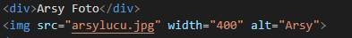
    - attribute *src* atau *source* adalah attribute untuk memberitahukan sumber gambar
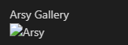
    - **alt** adalah alternatif jika gambar tidak berhasil dimunculkan, kita bisa memberi tahu ke user di tag img kita menampilkan gambar apa

#### **TABEL**
    - Sebuah tabel di HTML cukup membuat tiga tag :
   
```
 1. <table>
    sebagai element utama
 2. <tr> atau table row tag
    untuk membuat baris baru di dalam tabel
 3. <td> atau table data tag
    sebagai wadah (container) dari data yang mau isi di dalam <tr>
 ```

 Berikut merupakan syntax untuk membuat tabel sederhana :
 ```
<body>
    <table border="1">
        <thead>
            <tr>
                <td>No</td>
                <td>Nama</td>
                <td>Umur</td>
            </tr>
        </thead>
        <tbody>
            <tr>
                <td>1</td>
                <td>Gina</td>
                <td>24</td>
            </tr>
        </tbody>
    </table>
</body>

```


Membuat Tabel Sederhana
<!-- Membuat Tabel -->
<body>
    <table border="1">
        <thead>
            <tr>
                <td>No</td>
                <td>Nama</td>
                <td>Umur</td>
            </tr>
        </thead>
        <tbody>
            <tr>
                <td>1</td>
                <td>Gina</td>
                <td>24</td>
            </tr>
        </tbody>
    </table>
</body>


#### **HTML FORM**
Tag Form digunakan untuk membuat Form
```Form
<!-- Membuat Form -->
<body>
    <form>
        <!-- di dalam tag form ada beberapa element -->
        <input type="text"/>
        <input type="number"/>
        <input type="password"/>
        <input type="file"/>
        <input type="email"/>
        <!-- Di dalam element input ada beberapa atributte yang bisa digunakan -->
        <select>
            <option value="">Pilih Kota</option>
            <option value="bandung">Bandung</option>
            <option value="sumbawa">Sumbawa</option>
            <option value="jakarta">Jakarta</option>
        </select>
        <textarea>Tulis Komentar</textarea>

        <button type="submit">Klik Disini</button>
    </form>
</body>
```

Jika kita jalankan, maka output nya seperti berikut ini

<!-- Membuat Form -->
<body>
    <form>
        <!-- di dalam tag form ada beberapa element -->
        <input type="text"/>
        <input type="number"/>
        <input type="password"/>
        <input type="file"/>
        <input type="email"/>
        <!-- Di dalam element input ada beberapa atributte yang bisa digunakan -->
        <select>
            <option value="">Pilih Kota</option>
            <option value="bandung">Bandung</option>
            <option value="sumbawa">Sumbawa</option>
            <option value="jakarta">Jakarta</option>
        </select>
        <textarea>Tulis Komentar</textarea>
        <button type="submit">Klik Disini</button>
    </form>
</body>


### **Semantic HTML**
Semantic HTML artinya kita menggunakan element HTML sesuai kebutuhan

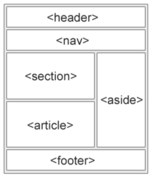

- **tag header** untuk header
- **tag nav** untuk navigasi
- **tag footer** untuk footer

### **DEPLOY**
Deploy adalah proses untuk mempublish proyek yang sudah kita kerjakan agar dapat digunakan oleh semua orang. Jika projek kita HTML kita perlu mendeploy ke server.
Salah satu caranya yaitu menggunakan *Netlify*


## **4. CSS (Cascading Style Sheet)**
    Untuk mempercantik dan mendesain halaman website kita menggunakan CSS. Dengan CSS, kita bisa mengubah warna, menggunakan font custom, mengatur tata letak, dan lain-lain.

Untuk lebih jelasnya, kita bisa lihat dari gambar di bawah ini
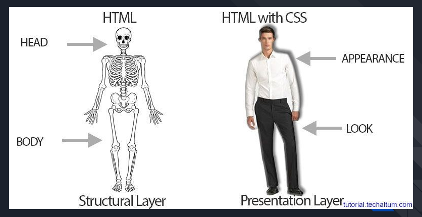

Jika dilihat dari gambar di atas, kita bisa gambarkan bahwa HTML merupakan kerangka website dan CSS merupakan baju 
### **Tiga Cara Menggunakan CSS**
1. Inline Styles : memberikan attribute style kepada sebuah element dengan menyisipkan langsung di dalam HTML tersebut
Contohnya :
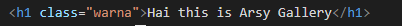

2. Internal CSS : Kita bisa menggunakan Tag **style** pada file HTML dan diletakkan di dalam Tag **head**
Contohnya :
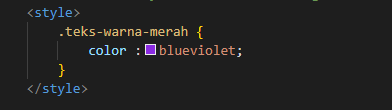

3. External CSS : yaitu membuat file **.css** terpisah untuk mendesain halaman website
Contohnya :
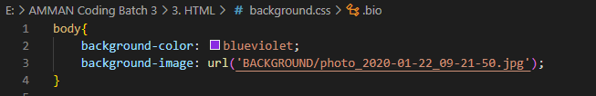


## **5. Flexbox**
Flexbox (Flexible Box) dapat memudahkan programmer untuk mengatur layout, posisi, dan ukuran tiap element di dalamnya.

Ada 2 istilah penting di Flexbox :
1. Container : element yang membungkus dan mengatur tampilan dari element di dalamnya
* 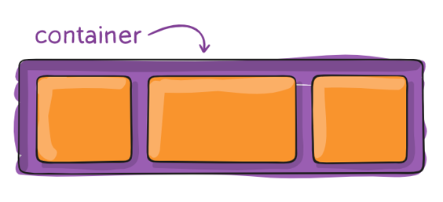
2. Item : adalah element dalam container yang diatur tampilannya
* 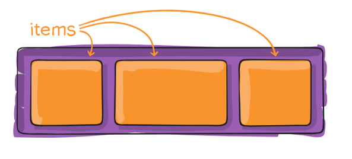

Flexbox memiliki 1 parent/container dan bisa beberapa child/item

## **6. Algoritm & Pseudocode**
Algoritma adalah langkah-langkah yang dibutuhkan untuk menyelesaikan suatu masalah

- Kualitas dari Algoritma
    1. Input dan Output harus didefinisikan terlebih dahulu
    2. Setiap step harus benar-benar jelas dan rinci
    3. Algoritma seharusnya tidak mengandung suatu code pada bahasa pemrograman tertentu

### Algoritma itu harus GENERAL
    Kita harus beradaptasi dengan teknologi terbaru.Dengan membuat algoritma dan membuatnya secara general, kita bisa mentranslate algoritma tersebut ke dalam bahasa pemrograman APAPUN

### *Programming itu adalah __algoritma__ dan __struktur data__*
- Data struktur digunakan untuk mengelola sebuah data
- Algoritma yang akan menyelesaikan suatu permasalahan menggunakan data tersebut

*Note : Untuk dapat menggunakan semua bahasa programming, yang perlu kita pelajari dan pahami adalah Algoritma*

__Contoh Algoritma__
```
input 1 : 10
input 2 : 5
Output : 15

1. Mulai
2. Definisi Variabel input 1, input 2, output
3. Baca nilai input 1 dan input 2 
4. Menjumlahkan input 1 dan input 2, lalu disimpan pada variabel output
5. Menampilkan variabel output 
```
### Pseudocode
Pseudocode adalah tools untuk menulis algoritma. Menuliskan algoritma umumnya menggunakan baahsa inggris sebelum kita implementasikan ke bahasa pemrograman tertentu.

#### - Menulis Pseudocode menggunakan huruf besar pada kata kunci

Contoh Pseudocode
```
STORE "jam" with any value 
STORE "results" without any value

INPUT "jam" with 2

CALCULATE "jam" times 3600
SET "results" value with calculation
DISPLAY "results"

```

### **PROCEDURAL**
Procedural (step by step) adalah cara berfikir secara runtun. Artinya serangkaian perintah yang berurutan
* Contoh :
* 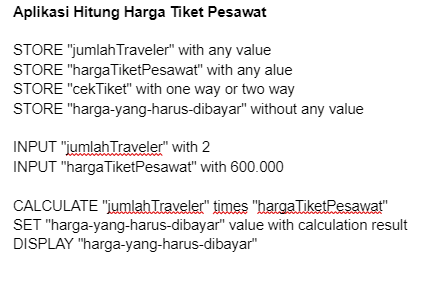


### **CONDITIONAL**
Conditional digunakan saat dibutuhkan percabangan kasus. Komputer akan melakukan suatu tindakan jika suatu kondisi terpenuhi
* Contoh :
* 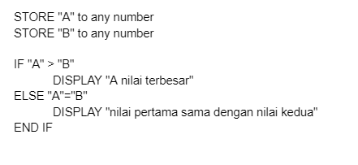

### **LOOPING**
Looping (perulangan) yaitu komputer dapat melakukan sebuah proses yang sama berulang-ulang
* Contoh
* 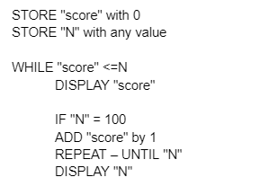

### **RECURSIVE**
Recursive adalah pola pikir dalam algoritma yang memanggil method/function di dalam suatu function


