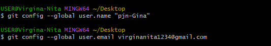
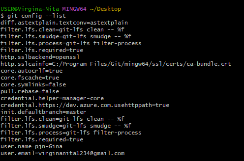
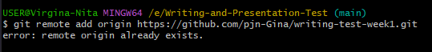
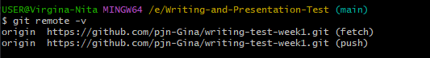

# TUGAS WRITING WEEK 1-Kind Knucker

## **1. CLI (Command Line Interface)**
* **Shell** merupakan program yang digunakan untuk  berkomunikasi atau memerintah sistem
* Shell yang berbasis teks dinamakan **Command Line Interface**
    - Contoh CLI :
    1. sh
    2. bash
    3. zsh
    4. cmd.exe

* Aplikasi yang digunakan untuk mengakses CLI disebut **Terminal Emulator**

## Mana sih yang dinamakan terminal ?

> *Nah, gambar di atas merupakan tampilan sebuah terminal emulator*
==============================================
### Navigation
    1. pwd (Print working directory)
    Command untuk mengetahui kita sedang berada di direktori mana saat ini
    
    2. ls (list)
    Command untuk menampilkan daftar file dan folder yang ada di sebuah direktori
    
    3. ls -la
    Command untuk menampilkan daftar file yang di hidden
    
    4. Touch
    Command untuk membuat suatu file pada direktori
    
    5. Cp
    Command untuk copy file /direktori
    
    6. Mv
    Command untuk memindahkan file/dirketori. Bisa digunakan untuk rename.
    mv nama_file_yang_mau_dipindahkan.ekstensi directory_yang menjadi_tujuan

    7 rm
    Command untuk menghapus file
    rm nama_file_yang_mau_dihapus.ekstensi

    8. rm -r
    COmmand untuk menghapus suatu folder
    rm -r nama_folder_yang_dihapus.ekstensi
    
    9. Cd (Change directory)
    Command untuk berpindah direktori/folder
    
    10. Cd ..
    Command untuk back/ kembali ke direktori sebelumnya
    
    11. Clear
    Command untuk membersihkan tampilan terminal

    12.  mkdir
    Command untuk membuat folder /direktori

    Membuat folder tanpa spasi : mkdir nama_folder_baru
    Membuat Folder dengan spasi: mkdir "nama folder baru"

## **2. GIT & GITHUB**
* **GIT** merupakan tools untuk programmer yang dapat melacak setiap perubahan file/folder.
    * GIT biasanya digunakan sebagai tempat penyimpanan file pemrograman.
    * File yang disimpan menggunakan GIT akan terlacak seluruh perubahannya, termasuk siapa yang mengubah file tersebut.
    * Setelah kita menginstall GIT, yang pertama kita lakukan adalah :
    1. konfigurasi akun git di git bash
    
    Note : email yang disetup *harus* sama dengan yang digunakan pada Github

    2. **git config --list** untuk melihat/cek hasil konfigurasi
    
    
    * Vendor/penyedia GIT
    1. Github
    2. Gitlab
    3. Bitbucket

* **GITHUB** untuk mengonlinekan codingan

    Dengan menggunakan GIT dan Github, kita bisa bekerja dalam sebuah tim. Tujuannya adalah kita bisa berkolaborasi mengerjakan proyek yang sama

* Repository adalah direktori proyek yang kita buat
* Repository GIT
1. **git init**
 untuk menginisialisasi git di folder/directory kerja kita
catatan : lakukan di dalam folder proyek

    *Note : untuk menghubungan git ke akun github menggunakan cara di bawah ini*
    
    *Cek apakah sudah terconnect atau belum dengan **git remote -v***
    
    *Jika sudah muncul tampilan seperti gambar di atas artinya akun github kita sudah terconnect*

2. **git status** untuk mengecek status dari git kita dan melihat adanya perubahan atau tidak yang dilakukan pada proyek tersebut, biasanya itu tentang file yang belum di add atau di commit

3. **git add** untuk mendaftarkan perubahan file pada suatu proyek ke staging area dan masih perlu di commit

    *Note :*
    * **modified** = kondisi dimana perubahan sudah dilakukan tapi belum ditandai

4. **git add .** untuk menambahkan seluruh file yang belum di add ke staging 

5. **git commit -m "Pesan Commit"** untuk menyimpan perubahan ke dalam version control

6. **git log** untuk melihat history / kumpulan checkpoint(commit) yang telah kita buat

7. **git revert (nomor commit)** untuk kembali ke checkpoint tanpa menghapus committan sesudahnya.

8. **git reset (nomor commit)** untuk kembali ke checkpoint dengan menghapus committan sesudahnya.

9. **git branch** untuk melihat kumpulan branch

10. **git branch (nama branch yang di inginkan)** untuk membuat branch baru

11. **git checkout (nama branch)** untuk pindah ke branch yang kita inginkan

12. **git checkout -b (nama branch)** untuk membuat branch baru dan langsung pindah ke branch yang kita baru buat

13. **git branch -d (nama branch)**
  menghapus branch 

- git merge <nama target branch yang ingin kita tarik>
  menggabungkan kedua buah branch

*
* d
* g

## **3. HTML (Hype Text Markup Language)**
## **4. CSS (Cascading Style Sheet)**
## **5. Flexbox**
## **6. Algoritm & Pseudocode**
